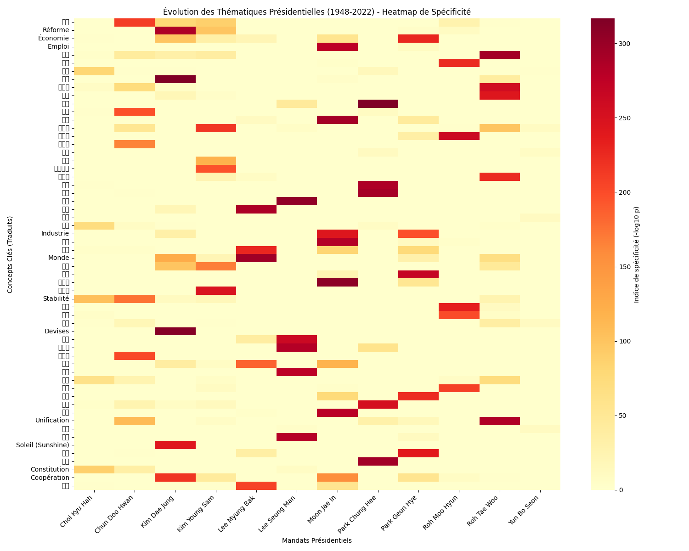
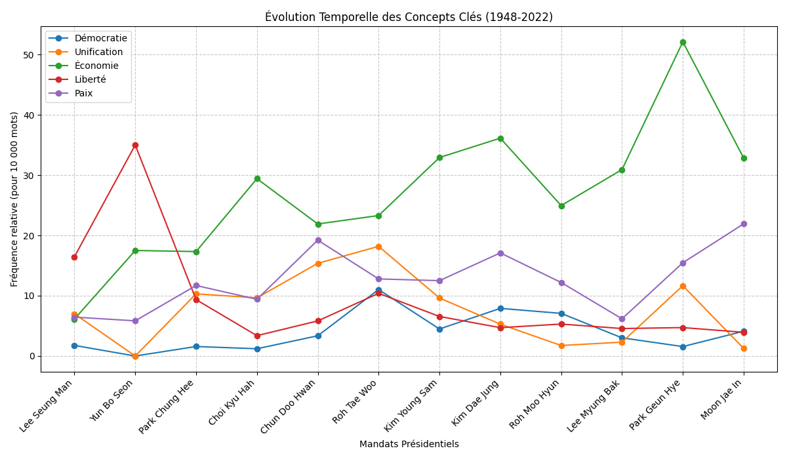
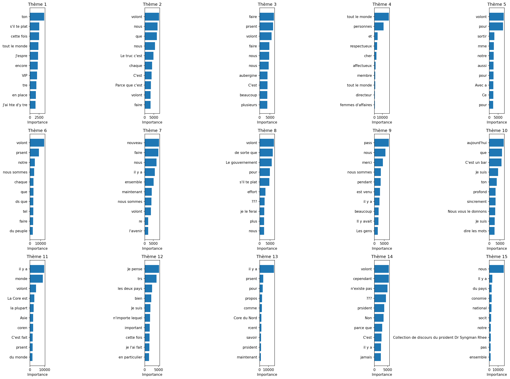
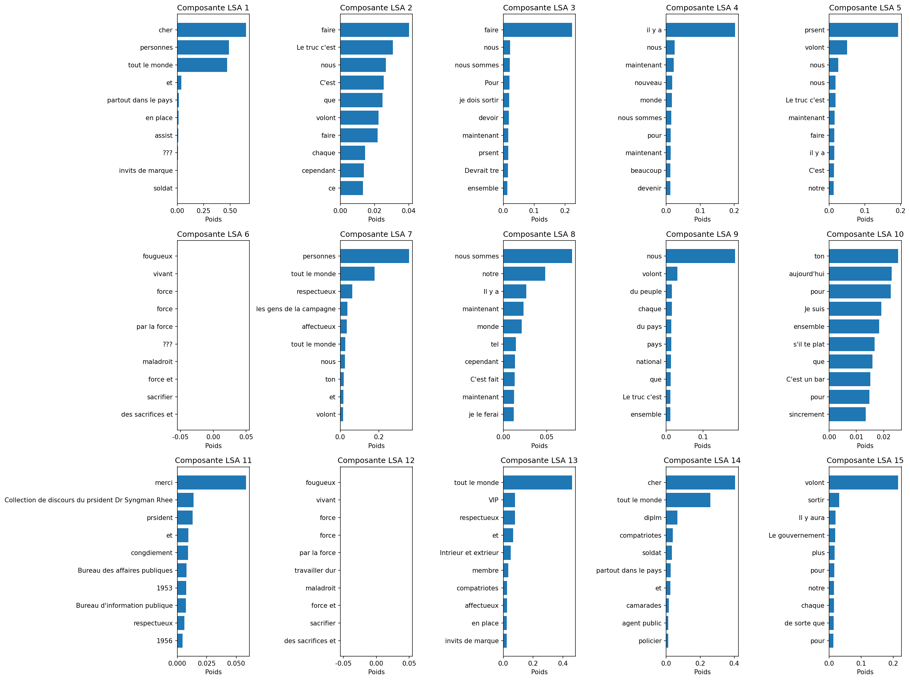

# Analyse Statistique et Sémantique des Discours Présidentiels Sud-Coréens (1948-2022)

**Auteur :** Marcel Nguyen  
**Domaine :** TAL R&D (Master 2)  
**Mots-clés :** Analyse de discours, Textométrie, Coréen, LDA/LSA, Spécificité de Lafon, Corée du Sud.

---

## 📄 Résumé / Abstract
Cet article présente une analyse textométrique et thématique exhaustive du corpus des discours présidentiels de la Corée du Sud, couvrant la période de 1948 à 2022. À travers l'utilisation d'outils de textométrie (TXM) et de modèles de thématiques latentes (LDA, LSA), nous explorons l'évolution du lexique politique sur douze mandats présidentiels. Nous mettons en évidence une stabilité remarquable du vocabulaire institutionnel contrastant avec des ruptures thématiques fortes liées aux crises historiques et sanitaires. Nos résultats montrent que si des termes comme *Gouvernement* ou *Nécessité* constituent le socle invariant du discours, des signatures spécifiques comme la *Crise du FMI* ou la pandémie de *COVID-19* permettent une classification précise des périodes politiques.

---

## 📊 Résultats Visuels

### 1. Carte de Chaleur des Spécificités (Heatmap)
Visualisation des ruptures et continuités thématiques à travers 70 ans d'histoire. Chaque bloc de couleur représente la spécificité (Indice de Lafon) d'un concept par rapport à un mandat présidentiel.

### 2. Évolution des Concepts Clés
Suivi diachronique des fréquences relatives (pour 10 000 mots) des piliers de la rhétorique sud-coréenne : *Démocratie*, *Unification*, *Économie*, *Liberté* et *Paix*.

---

## 🔬 Analyse des Résultats

### Posture Énonciative et Leadership
L'analyse des formes de l'énonciation révèle un contraste marqué entre les périodes. Les présidents fondateurs présentent une fréquence élevée du **"Nous"** (*uri*), traduisant une rhétorique de mobilisation collective. À l'inverse, les présidences récentes (Moon Jae-in) montrent une chute de ce "Nous" au profit d'un discours plus technique et institutionnel, tout en maintenant un ratio performatif (verbes d'action) stable de 84%.

### Modélisation Thématique Latente (LDA & LSA)
Nous avons utilisé des modèles probabilistes pour extraire les thématiques indépendantes des choix lexicaux bruts. Les thèmes de *Sécurité Nationale* et de *Relations Internationales* apparaissent comme des invariants structurels du discours.

| Thèmes LDA (15 Clusters) | Projection des Composantes LSA |
|:---:|:---:|
|  |  |

---

## ⚙️ Documentation Technique

### Architecture du Corpus
- **Volume** : 9 984 discours, 345 491 paragraphes.
- **Analyseur** : Kkma (KoNLPy) pour une segmentation morphosyntaxique fine (PoS tagging).
- **Format** : Export XML-TEI pour compatibilité TXM.

### Utilisation des Scripts
1. **Prétraitement** : `source venv/bin/activate && python export_to_txm.py`
2. **Analyse de Spécificité** : `python analyze_txm_specificity.py`
3. **Topic Modeling** : `python analyse_lda_15topics.py` (CPU) ou `python analyse_lsa_gpu.py` (GPU)
4. **Visualisation** : `python generate_lexical_heatmap.py` et `python analyze_temporal_trends.py`

---

## 📚 Références
- Lafon, P. (1980). *Sur la variabilité de la fréquence des formes dans un corpus*. Mots.
- Blei, D. M. (2003). *Latent Dirichlet allocation*. JMLR.
- Park, E. L. (2014). *KoNLPy: Korean natural language processing in Python*. ACL.

---
*Ce projet a été réalisé dans le cadre d'un projet de recherche en TAL R&D.*
